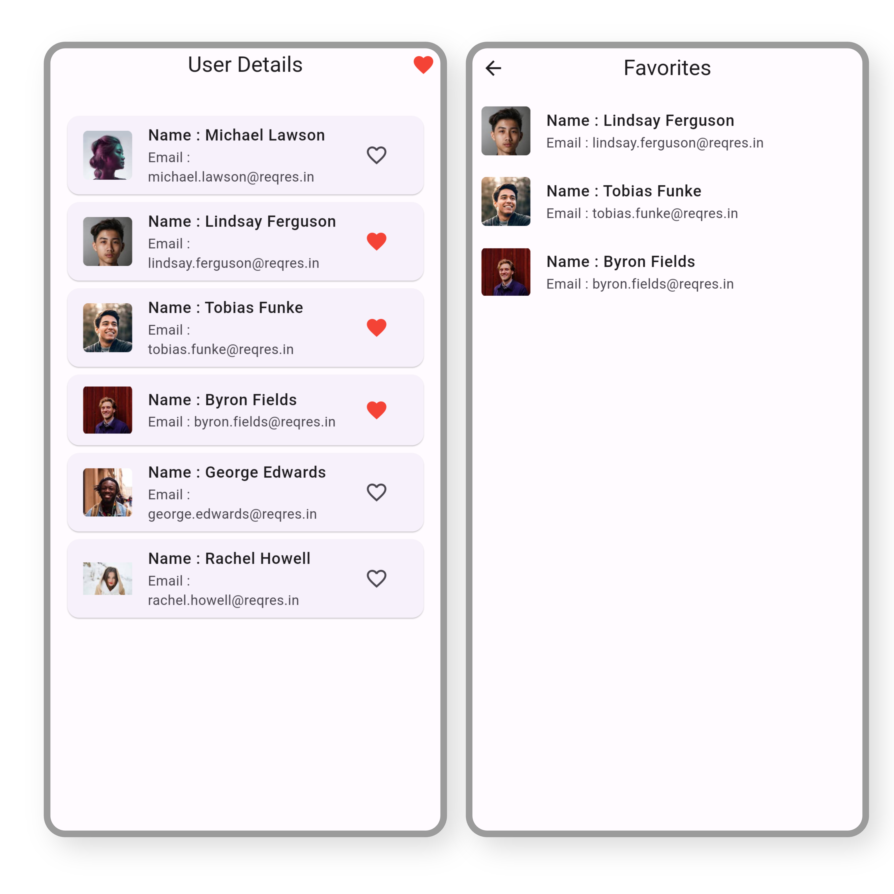

# Mark As Favorite


The app employs a feature-first clean architecture, utilizing SharedPreferences for local storage. Each tile can be marked as favorite or unfavorite, enhancing user customization and experience.
#### Screenshots




## Features

- BLOC
- Feature First clean Architecture
- Local Storage
- Favorite and Unfavorite person
## API Reference

#### Get all items

```http
https://reqres.in/api/users?page=2
```


